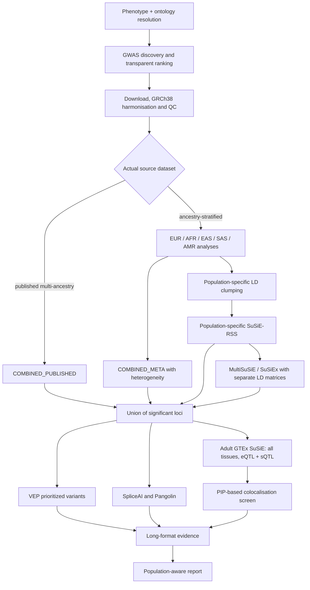

# GWAS2Mechanism

GWAS2Mechanism is a phenotype-agnostic, population-aware framework that automatically discovers GWAS summary statistics and integrates ancestry-specific and cross-ancestry fine-mapping with functional annotation, GTEx molecular-QTL evidence and sequence-level splicing prediction to prioritize candidate variant → gene → tissue → mechanism relationships.

The command-line tool is `gwas2m`. It uses Polars/Parquet for genome-scale tables, PLINK2 for population-matched LD, SuSiE-RSS for population-specific fine-mapping, MultiSuSiE or SuSiEx for cross-population fine-mapping, Ensembl VEP, compact Adult GTEx SuSiE eQTL/sQTL resources, SpliceAI, Pangolin, and a restartable Snakemake DAG.



## Installation

Mamba is the supported solver. Installation is self-contained under the
repository: environments and the package cache are stored in `.gwas2m/`,
scientific resources in `.gwas2m/resources/`, and results in `runs/`.

For a complete one-command installation—including every isolated environment,
all scientific resources, validation tests, and a synthetic example—run:

```bash
git clone https://github.com/MuhammadMuneeb007/GWAS2Mechanism.git
cd GWAS2Mechanism
bash Install.sh
```

The resource phase is restartable but is not a quick package install: the
population reference panels, GTEx data, and VEP cache can require hours and
substantial disk space. Rerunning `bash Install.sh` reuses completed work.

For a quick core-only installation:

```bash
git clone https://github.com/MuhammadMuneeb007/GWAS2Mechanism.git
cd GWAS2Mechanism
bash scripts/install.sh
source scripts/activate.sh
gwas2m doctor
```

The lower-level equivalent for isolated VEP/SpliceAI/Pangolin/R environments
and all scientific resources is:

```bash
bash scripts/install.sh --full --example
# The same checkout can be activated again in later shells:
source scripts/activate.sh
```

Resources are cached under `./.gwas2m/resources` by default, validated,
recorded in `manifest.tsv`, and reused. `GWAS2M_CACHE` can explicitly override
that location. Preview the large download plan with
`gwas2m setup --all --dry-run`.

## Quick start

```bash
gwas2m discover --phenotype "migraine"
gwas2m run --phenotype "migraine" --populations auto --tissues all --mode fast --threads 32
gwas2m resume --run runs/migraine/latest
gwas2m report --run runs/migraine/latest
```

A download-free complete smoke test is available for installation validation:

```bash
gwas2m run --phenotype "synthetic phenotype" --synthetic
```

## Population strategy

The framework preserves reported ancestry text and maps metadata to `EUR`, `AFR`, `EAS`, `SAS`, or `AMR` only when supported. Approximate mappings are flagged; unresolved cohorts remain `UNKNOWN` or `UNMAPPED`. An aggregated multi-ancestry file is never split into artificial ancestry datasets. It is analyzed as `COMBINED_PUBLISHED`. `COMBINED_META` is created only from compatible, independently reported ancestry-stratified effects after allele harmonisation. Cross-population fine-mapping supplies one summary-statistic vector, sample size, and LD matrix per ancestry; it never builds a naive pooled LD matrix.

## Adult GTEx all-tissue strategy

`qtl.tissues: all` is the default. Every tissue present in the selected stable Adult GTEx compact SuSiE fine-mapping release is eligible for eQTL and sQTL matching. Tissues may be ranked in the report but are not pre-filtered by phenotype. Fast mode avoids unexpectedly downloading dense all-association resources.

## Fast and full modes

Fast mode selects the strongest usable study per population, fine-maps genome-wide-significant loci, annotates the prioritized variant union once, scans compact all-tissue GTEx SuSiE resources, predicts splicing once per variant, and performs a fine-mapping-based colocalisation screen. Full mode may retain multiple suitable studies, extra QTL resources, MR-MEGA, and formal coloc for top pairs when dense regional inputs are locally available and below the configured download limit.

## Output structure

Each run is isolated under `runs/<phenotype>/<run_id>/` with `manifest.yaml`, resolved configuration, discovery tables, population-specific GWAS/loci/fine-mapping directories, multi-ancestry results, annotation, `qtl/all_tissues`, splicing, colocalisation, evidence, and HTML/Markdown/TSV reports. `runs/<phenotype>/latest` points to the newest run when the platform supports symlinks (otherwise it is a small text pointer).

## Scientific caveats

1. Summary statistics cannot be retrospectively split by ancestry.
2. LD must match ancestry as closely as possible, and 1000 Genomes may not perfectly represent a cohort.
3. Smaller studies—often non-European—have lower power; missing evidence is not biological absence.
4. PIP-product shared-variant screening is not formal `coloc.susie`.
5. VEP annotations and SpliceAI/Pangolin scores are predictions, not experimental validation.
6. Gene-body overlap does not establish mediation, and tissue QTL evidence does not prove a causal tissue.
7. Effect heterogeneity is retained and must be interpreted rather than hidden by meta-analysis.

SpliceAI source/model licensing restricts model use to qualifying non-commercial purposes unless a commercial license is obtained; review the upstream license before running that optional stage.

Use terms such as “candidate causal variant,” “colocalisation evidence,” “predicted splice effect,” and “candidate regulatory mechanism.”

See [docs/SCIENTIFIC_LIMITATIONS.md](docs/SCIENTIFIC_LIMITATIONS.md) for the
full interpretation guide.

## Development and citation

Run `ruff check .` and `pytest -q`; see [CONTRIBUTING.md](CONTRIBUTING.md). Cite this software using [CITATION.cff](CITATION.cff), plus the GWAS, reference panel, GTEx, VEP, SuSiE/MultiSuSiE, SpliceAI, and Pangolin sources recorded in each run manifest.
